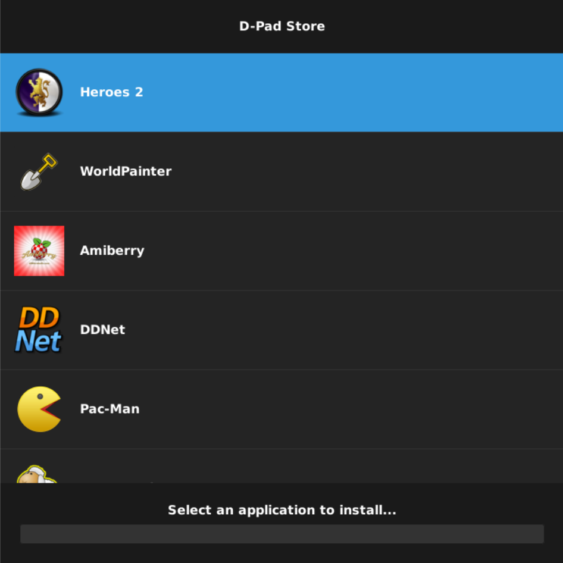

# D-Pad Store

[](https://opensource.org/licenses/GPL-3.0)
[](https://wiki.gnome.org/Projects/Vala)


**A full-screen kiosk-style game store with a user interface fully navigable with a gamepad.**



D-Pad Store is a visual wrapper over [Pi-Apps](https://github.com/Botspot/pi-apps) scripts. It provides a gamepad-navigable interface to browse and install games.


## Compilation

1. Install dependencies:

   ```sh
   sudo apt-get install meson ninja-build valac libvala-*-dev libglib2.0-dev libgtk-3-dev libsdl2-dev python3
   ```

2. Clone this repository:

   ```sh
   git clone https://github.com/libredeb/dpad-store.git
   cd dpad-store/
   ```

3. Create a build folder:

   ```sh
   meson setup build --prefix=/usr
   ```

4. Compile D-Pad Store:

   ```sh
   ninja -C build
   ```

5. Install D-Pad Store in the system:

   ```sh
   sudo ninja -C build install
   ```

6. (OPTIONAL) Uninstall D-Pad Store:

   ```sh
   sudo ninja -C build uninstall
   ```

## Prerequisites

D-Pad Store requires [Pi-Apps](https://github.com/Botspot/pi-apps) installed in the user's home directory (`~/pi-apps`). Follow the Pi-Apps installation instructions before running D-Pad Store.

## Developer Section

### Linting

To lint Vala code, you can use [vala-lint](https://github.com/vala-lang/vala-lint), a tool designed to detect potential issues and enforce coding style in Vala projects.

Read the instructions to install it on your local machine.

**Usage**

Run `io.elementary.vala-lint` command in your project source code directory:

```sh
io.elementary.vala-lint src/
```

### Translations

To add more supported languages, edit the [LINGUAS](./po/LINGUAS) file and update the translation template file running:

```sh
cd build
ninja io.github.libredeb.dpad-store-pot
```

And to generate each LINGUA `po` file:

```sh
ninja io.github.libredeb.dpad-store-update-po
```

## License

This project is licensed under the GNU General Public License v3.0 or later - see the [COPYING](COPYING) file for details.

⭐ If you like D-Pad Store, leave me a star on GitHub!
